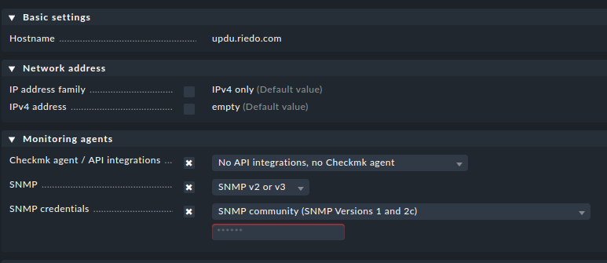

# Setup

Setting up the extension is relatively straight forward in the paid versions
of checkmk. Follow the instructions from the official manual:

[Checkmk: Adding an MKP](https://docs.checkmk.com/latest/en/mkps.html#_adding_an_mkp)

Should you use the open-source (Raw) version, perform according to the following
section to install the extension manually.

## Manual installation

For the Raw Edition of Checkmk, no visual (web-based) interface to install
extensions is available. Thus, one has to manually install the extension
from the command line.

First copy the package to the checkmk server and make it readable by any user
of the system. This can be done securely via `scp` or any other mean of choice:

```
scp rnx_updu-0.0.1.mkp root@172.17.0.2:/tmp
ssh root@172.17.0.2 'chmod a+r /tmp/rnx_updu-0.0.2.mkp'
```

Once the package is available on the server, connect and install the extension.
As the checkmk user usually does not come with an actual login, it may be
required to connect as root (which may have to be explicitly allowed in the
`sshd` configuration).

Once connected, the installation proceeds with a checkmk user, in this case
named `cmk`.

```
ssh root@172.17.0.2
omd su cmk
mkp add /tmp/rnx_updu-0.0.2.mkp
mkp enable rnx_updu
```

This should not yield any errors and checkmk now allows fetching data from
any `UPDU`.

## Upgrade

If an older version of the package is already installed, 
it must be disabled before the latest version can be enabled.

```
omd su cmk
mkp disable rnx_updu
mkp add /tmp/rnx_updu-0.0.2.mkp
mkp enable rnx_updu 0.0.2
```

# Host configuration

## Add a new host

Once the plugin is installed, adding a new `UPDU` is straight forward.
Navigate to `Setup->Hosts` and use the `Add Host` button to connect a new
device.

To avoid issues with errors from built-in agents, configure the host according
to the following illustration :

{ width=100% }

